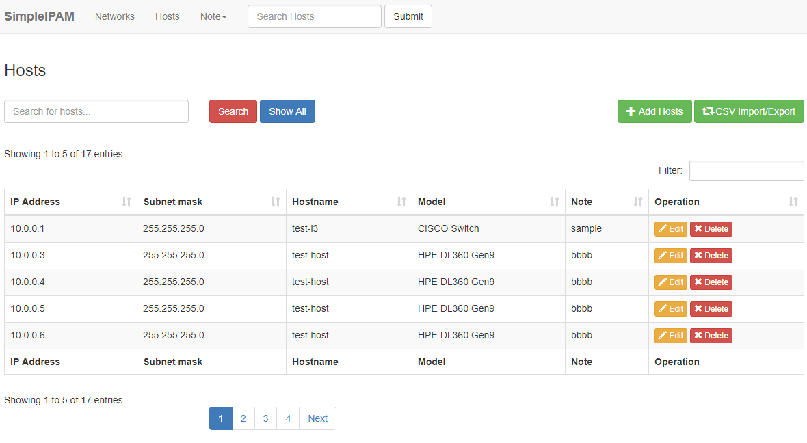
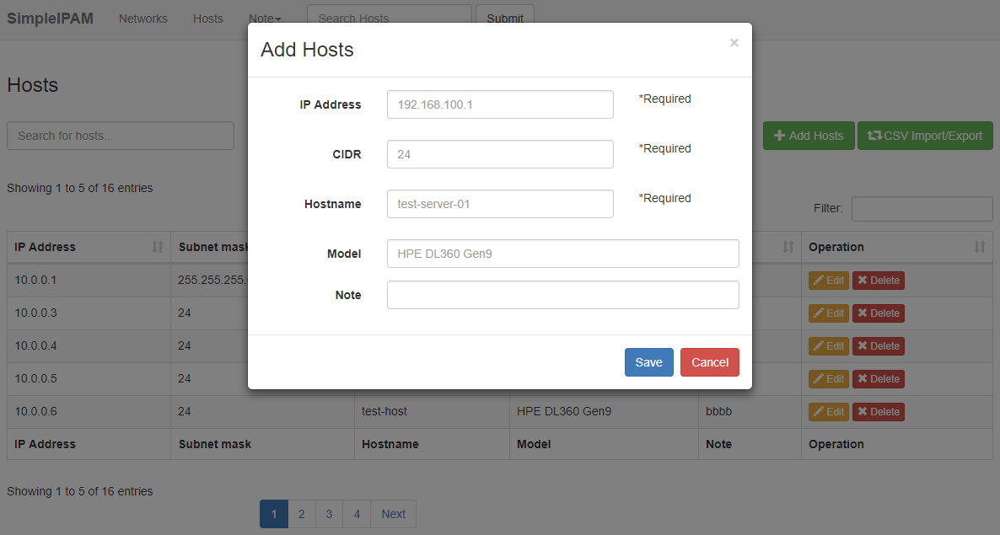

# SimpleIPAM - Simple IP address management


## What is SimpleIPAM?
SimpleIPAM is IP address management(IPAM) for Small and medium-sized enterprises.
This can manage IP address and networks like VLAN.
This is very simple and very useful.


## Screenshots





## Features
* Modal Popup
* Using SQLite
* CSV Export / Import 


## Dependencies
* PHP >= 5.3.7 (recommends PHP 5.4 or newer)
* Apache (Nginx etc)
* SQLite3

## Using
* Codeigniter 3.1.5
* Bootstrap v3.3.7
* jQuery v3.2.1
* DataTables 1.10.7
  * https://www.datatables.net/
* csv-import
  * CSV Import is a Codeigniter spark which makes it easy to import a CSV file into an associative array.
  * https://github.com/bradstinson/csv-import


## Installation
- Download SimpeIPAM with GitHub
- Upload SimpeIPAM in Document Root in Nginx # /var/www/html/simpleipam
- Copy ipam.db.sample to ipam.db   # sqlite/ipam.db


## Configuration
### Change Per Page
Edit $config['per_page'] in controllers/Networks.php and controllers/Hosts.php
For example, change  "5" to "300"

```
public function index()
{
  ....
  $config['per_page'] = "5";
  ....
}

function search()
{
  ....
  $config['per_page'] = "5";
  ....
}
```
