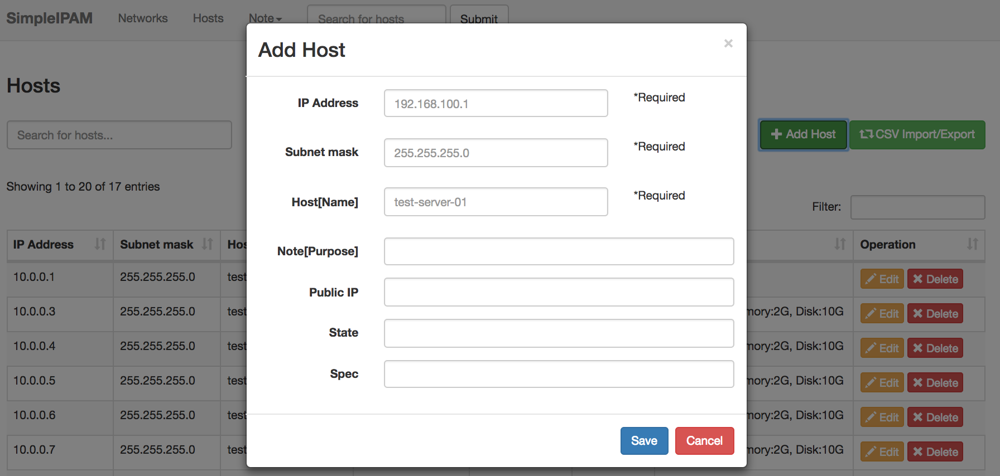

# SimpleIPAM - Simple IP address management


## What is SimpleIPAM?
SimpleIPAM is IP address management(IPAM) for Small and medium-sized enterprises.  
This can manage IP address and networks like VLAN.  
This is very simple and very useful.  


## Screenshots
#### Screenshot1

#### Screenshot2

#### Screenshot3



## Features
* Modal Popup
* Using SQLite
* CSV Export / Import 


## Dependencies
* PHP >= 5.3.7 (recommends PHP 5.4 or newer)
* Apache (uses .htaccess)
* SQLite3

## Using
* Codeigniter 3.1.5
* Bootstrap v3.3.7
* jQuery v3.2.1
* DataTables 1.10.7
  * https://www.datatables.net/
* csv-import
  * CSV Import is a Codeigniter spark which makes it easy to import a CSV file into an associative array.
  * https://github.com/bradstinson/csv-import


## Installation
- Install Dependencies
- Download SimpeIPAM with GitHub
- Upload SimpeIPAM in Document Root in Apache # /var/www/html/simpleipam
- Copy ipam.db.sample to ipam.db   # sqlite/ipam.db


## Configuration
### Adjust `Firewall` 
Please seek information about `SELinux`, `firewall` to web..  
And adjust settings properly..  
(If settings are too firm (example, SELinux is `Enforcing`),   
 you might fail to add/update/delete record to db.)  

### Enable `log_message`
Edit $config['log_threshold'] in config/config.php  
(If need, set $config['log_path'], $config['log_file_extension'] properly. 
 Pay attention to the permissions of log file output directory.)  
For example, change "0" to "1 :Error Messages (including PHP errors)"

```
//$config['log_threshold'] = 0;
$config['log_threshold'] = 1;
```

### Change Per Page
Edit $config['per_page'] in controllers/Networks.php and controllers/Hosts.php  
For example, change "5" to "300"  

```
public function index()
{
  ....
  //$config['per_page'] = "5";
  $config['per_page'] = "300";
  ....
}

function search()
{
  ....
  //$config['per_page'] = "5";
  $config['per_page'] = "300";
  ....
}
```


## ChangeLog
v3.0
  * Add Columns (See sqlite\NOTE.txt)

v2.0
  * Delete Model Column in hosts

v1.0
  * First Release